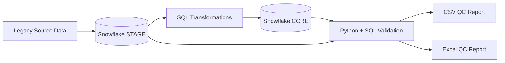

# Risk Data Modernization — Snowflake Pipeline Simulation

Enterprise-style data modernization project that ingests legacy-formatted insurance data into Snowflake, transforms it from a raw staging layer into a clean dimensional model, and automates validation/QC reporting with SQL and Python.

The project emphasizes correctness, reproducibility, and auditability rather than only loading data successfully.

## Overview

The pipeline simulates a common modernization pattern:

```text
Legacy-style source data
  -> STAGE schema
  -> transformation / business-rule enforcement
  -> CORE dimensional model
  -> automated validation
  -> QC reports (CSV / Excel)
```

Because Informatica Cloud execution was unavailable under the original environment constraints, the implementation uses Snowflake SQL and Python while preserving equivalent ETL mapping logic and documentation.

## Architecture



## Tech Stack

| Layer | Technology | Role |
|---|---|---|
| Warehouse | Snowflake | STAGE and CORE data layers |
| Transformation | SQL | Cleansing, casting, business rules, dimensional loading |
| Orchestration | Python | Pipeline execution and QC automation |
| Reporting | CSV / Excel | Validation output |
| Documentation | Markdown / DOCX | Mapping, workflow, and learning documentation |
| Version control | Git / GitHub | Reproducible project history |

## Data Model

### STAGE

`STAGE.POLICY_RAW`

Raw landing data intentionally preserves legacy-style characteristics such as:

- dates represented as strings
- coded status values
- records that may violate business rules
- source-oriented rather than analytics-oriented structure

### CORE

`CORE.DIM_POLICY`

The target model converts staged data into an analytics-ready dimension with:

- typed dates
- standardized business labels
- rejected invalid business values
- generated surrogate keys

## Transformation Flow

The STAGE-to-CORE load performs transformations such as:

1. safe-cast legacy date strings to Snowflake `DATE`
2. translate coded statuses to business-friendly labels
3. reject values that violate rules such as negative premiums
4. generate surrogate keys for the dimensional target
5. load validated records into the CORE layer

Transformation logic is represented in SQL while Python orchestrates execution and reporting.

## Repository Structure

```text
risk-data-modernization-snowflake/
├── sql/
│   ├── 01_setup_context.sql
│   ├── 02_stage_tables.sql
│   ├── 03_core_tables.sql
│   ├── 04_stage_to_core_load.sql
│   └── 05_validation_checks.sql
├── etl/
│   └── run_pipeline.py
├── docs/
│   ├── Risk_Data_Modernization_Project_Documentation.docx
│   ├── Risk_Data_Modernization_Beginner_Learning_Guide.docx
│   └── Informatica_Mapping_Design_Conceptual.docx
├── outputs/
│   ├── qc_report_.csv
│   └── qc_report_.xlsx
├── requirements.txt
└── README.md
```

## Data Quality & Validation

The project treats validation as a first-class pipeline stage rather than an afterthought.

Implemented checks include:

- source/target row-count reconciliation
- rejected-record identification
- null and completeness checks
- business-rule enforcement
- code-standardization validation
- duplicate detection

The validation layer produces QC outputs that make pipeline results inspectable outside the warehouse.

## Engineering Decisions

### Separate STAGE and CORE schemas

The STAGE layer preserves source-shaped data while CORE represents cleaned business data.

This separation makes it possible to distinguish ingestion problems from transformation problems and provides a clearer audit path when a target record is missing or rejected.

### Safe casting instead of assuming source correctness

Legacy systems frequently encode typed values as strings. Transformations use defensive conversion rather than assuming every value can be cast safely.

### Explicit rejected-record handling

Invalid values are treated as observable data-quality outcomes rather than silently coercing them into valid-looking records.

### Validation after transformation

A successful SQL statement does not prove the data is correct. Row counts, duplicates, nulls, standardized codes, and rule violations are validated explicitly after the load.

### Python orchestration around SQL

SQL remains the source of truth for warehouse transformations, while Python coordinates execution and exports validation results. This keeps transformation logic visible and reviewable instead of burying it entirely inside orchestration code.

## Informatica-Equivalent Design

The repository includes conceptual Informatica mapping documentation even though Informatica Cloud execution was not available in the original environment.

The goal is to demonstrate how the implemented SQL/Python workflow maps to enterprise ETL concepts without claiming that the project executed an Informatica runtime.

## Running the Pipeline

### Prerequisites

- Snowflake account
- Python environment
- Snowflake credentials supplied through environment configuration

Install dependencies and run:

```bash
python etl/run_pipeline.py
```

Expected outputs include:

- transformed STAGE/CORE warehouse state
- QC summary CSV
- QC Excel report

## Reliability & Auditability

The project is designed so that a reviewer can inspect:

- raw staged data
- transformation SQL
- target dimensional data
- validation queries
- generated QC outputs
- conceptual ETL mapping documentation

That traceability is important in financial-services and insurance data workflows where correctness must be explainable after execution.

## Engineering Challenges

### Dirty legacy representations

A modernization pipeline cannot assume that source strings, status codes, and numeric values already satisfy target constraints. The transformation layer therefore treats type conversion and business-rule validation as explicit operations.

### Proving correctness after a load

Moving rows from one table to another is not sufficient evidence that a migration succeeded. Reconciliation and data-quality checks are required to detect silent data loss, duplication, malformed values, or rule violations.

### Preserving enterprise-tool concepts under execution constraints

The implementation substitutes Snowflake SQL/Python for unavailable Informatica Cloud execution while documenting how the same mappings would be represented conceptually in an ETL platform.

## What I Would Improve Next

- add a claims fact table and referential-integrity checks
- add threshold-based PASS/FAIL controls to QC automation
- capture run metadata such as rows in/out and execution duration
- make pipeline runs idempotent and explicitly restartable
- add test fixtures for expected rejects and boundary cases
- add CI that validates SQL/Python structure without requiring production credentials
- add QC trend visualization across repeated runs

## Documentation

The `docs/` directory contains:

- full project documentation
- a beginner-oriented learning guide
- conceptual Informatica mapping design
